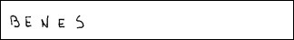
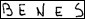
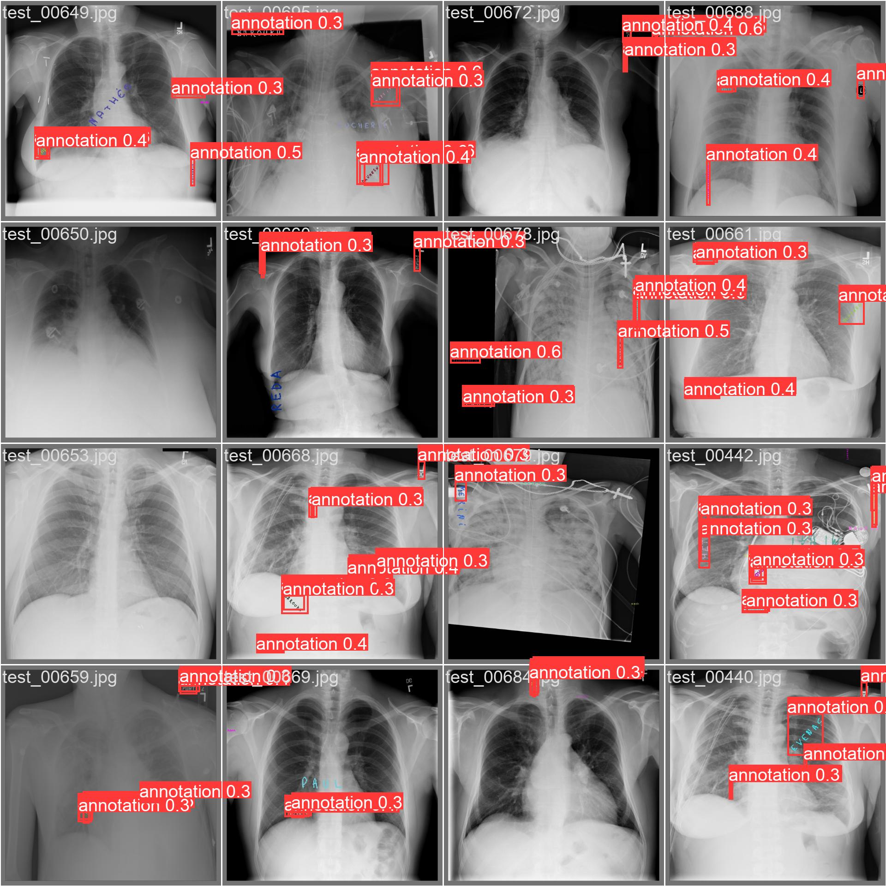

###Overview
Medical data collection and sharing have always been a fundamental challenge for medical image research. 
This is due to the Value and Importance of Health Information
This project can address this issue by detecting any added information on medical images or 
videos such as chest X-rays.\
In this project, we will only focus on deleting added information 
in form of telestration or printed/ handwritten text.
It will be used to automatically remove patients’ sensitive information from data to
facilitate data sharing and collection for such projects. 
####There are 2 main steps in this project.
**Data collection:** The first step is data collection, collecting target samples to create training, 
validation, or testing datasets. 
Collecting medical data is extremely difficult, costly, and
time-consuming, therefore, we'll be using synthetic data to train and validate our models.
Synthetic data is artificial data modeling a real-world robust data set. 
Creating synthetic data allows us to have complete control over the quantity of data and how it would look like. 
We can set specific attributes and randomized variables to create a robust dataset. 
The dataset should model real-world data.

**Training and validation**:
The next phase is to train and validate deep learning models using the synthetic data

###Installation Guide
####Generate your synthetic data
- clone the repository\
`gh repo clone https://github.com/AriyaRasekh/annotation_detector`

- set up the configurations, there are two configurations. _data_generator_config.py_ allows you to control 
different parameters of generated data and data sets.
_config.py_ is used for path configuration. You can go with default values as I used a relative path.\
If you are on a Linux machine, adjust path formats.
- pre_process raw handwritten wor images\
`python handwritten_words_PreProcess.py`\
  This will get rid of the background and margin, it will also generate a nice little pickle file.
  It contains image IDs that _data_generator.py_ can work with.\
   --->
  
- finally, create your data!\
`python data_generator.py`
#### Train your deep-learning model
####Select your model
Train a model on your dataset by specifying dataset name, batch-size, image size and either pretrained --weights like 
yolov5s.pt (recommended), or randomly initialized --weights '' --cfg yolov5s.yaml (not recommended).\
You can find a list of pretrained models and some comparisons 
[here](https://github.com/ultralytics/yolov5#pretrained-checkpoints). 
We select YOLOv5s in this example, the second-smallest and fastest model available.
####Train 
Here we train YOLOv5s on Chest_xRay_1 for 3 epochs\
`python train.py --img 640 --batch 16 --epochs 3 --data Chest_xRay_1.yaml --weights yolov5s.pt`\
All training results are saved to runs/train/ with incrementing run directories, i.e. runs/train/exp2, runs/train/exp3 etc.
Here is some sample result, as we can see, it can detect most of the annotations, even though it's not perfect.\
