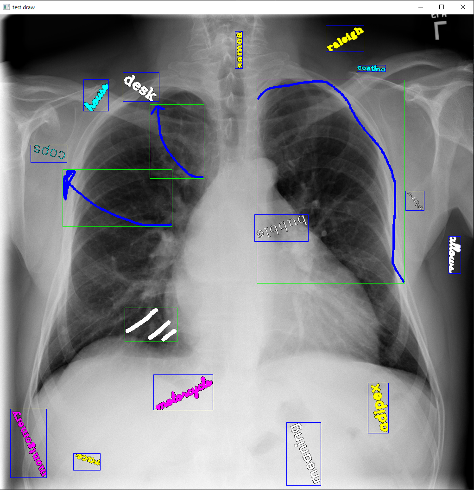

# patients' information detector on image
Automatic detection of patients' information and annotation on medical images

### Data Collection - Synthetic data
data_generator.py generates images modeling 
real-world medical data with specific attributes 
and randomized variables to create a robust dataset. 
It also provides drawing tools to manually create 
annotations on a medical image. The created custom 
dataset contains image and annotation data in a compatible 
format with the YOLO V5 network using **Open-CV**, **Numpy** and **image processing**.\
press and drag mouse to draw free-hand sketch\
press **S** to save data\
press **R** to randomized line size and color\
press **B** to show/hide bounding boxes\
press **SPACE** to capture bounding box of the last drawing\

